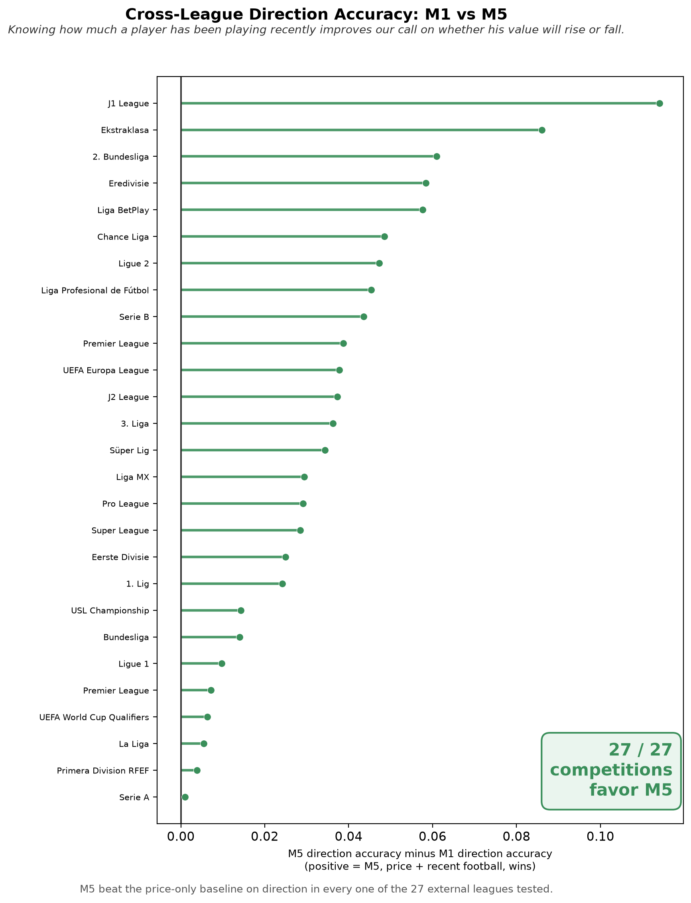
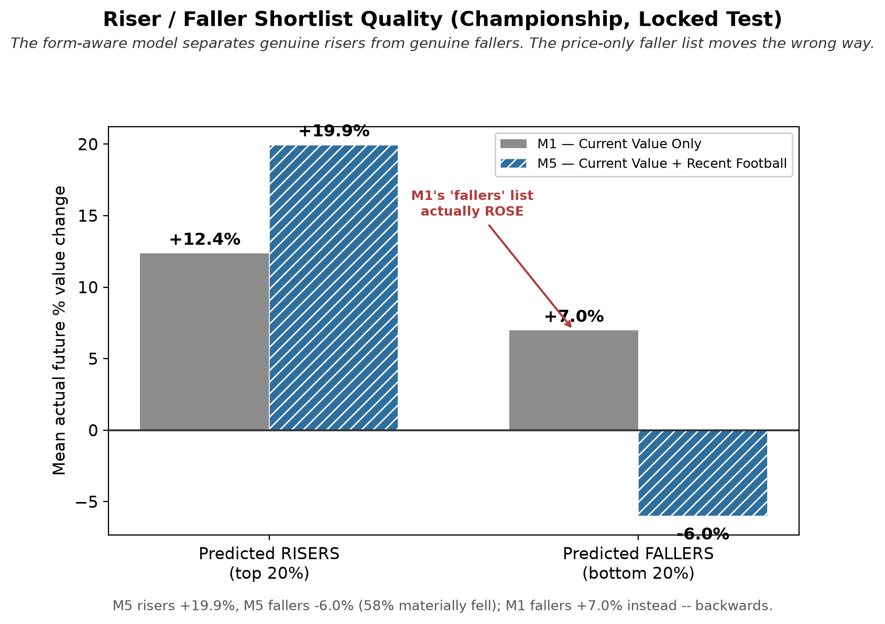
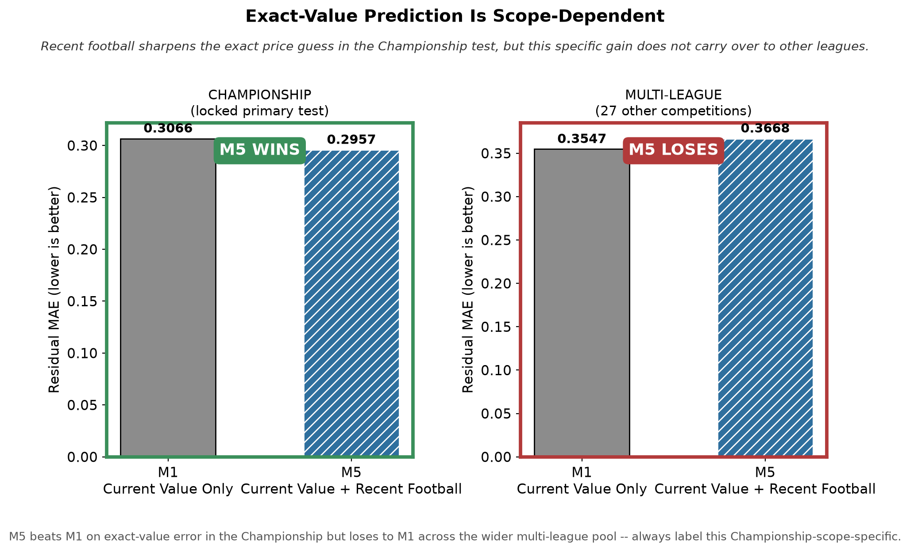

# Beyond Today’s Price: Predicting the Direction of Football Player Market Values from Recent Performance

> **Reproducibility status: partial.** Aggregate results, validation code, figures, and the final paper are public. Raw and row-level data are excluded because redistribution rights were not established.

Recent football performance provides a useful forward-looking signal for the **direction** of player market value. On the locked English Championship test, adding recent performance increased three-class direction accuracy from **35.6% to 46.7%**. Across 27 external competitions, the performance-informed model improved direction accuracy over the price-only comparator in every competition, while exact-value improvements were substantially less consistent.

## Research motivation

Current market value is informative, but recruitment, retention, and transfer-timing decisions also depend on whether a player's value is likely to rise, remain stable, or fall. This study asks whether recent football performance adds useful forward-looking information beyond current value and valuation history.

The intended workflow is decision support: begin with an existing scouting list and current valuations, add a recent-performance signal, classify likely risers, stable players, and fallers, and then reprioritize human scouting. It is not an automated valuation or transfer-fee engine.

## Dataset and prediction task

The broader analytical panel contains **8,433 player-decision events** for **1,132 players** from July 2022 through June 2025. The locked primary evaluation uses **752 valuation events from 606 players** in the English Championship. External evaluation covers **27 competitions**.

All predictors are restricted to information available before each valuation date. The feature ladder begins with current market value, adds six valuation-history features, and then adds 25 recent-football features covering playing time, attacking, goalkeeping, defending, chance creation, and possession progression.

The models predict the residual change in the logarithm of the next observed market value. Results are assessed through residual mean absolute error (MAE), three-class direction accuracy, and Spearman rank correlation. Lower MAE is better; direction accuracy measures correct rise/stable/fall calls; Spearman measures ranking agreement.

## Models

- **M1 — price-only comparator:** current market value.
- **M5 — performance-informed model:** current market value plus the 25 recent-performance features.

Model selection was completed before the locked test was opened. Uncertainty was evaluated with 2,000 player-clustered bootstrap draws so repeated observations for the same player remained grouped.

## Championship held-out results

| Metric | M1 | M5 |
|---|---:|---:|
| Residual MAE | 0.3066 | **0.2957** |
| Direction accuracy | 35.6% | **46.7%** |
| Spearman correlation | 0.278 | 0.296 |

The majority-class direction benchmark is **42.3%**. M5 therefore improves both on M1 and on that benchmark for directional classification. The player-clustered intervals support the MAE and direction differences, but do not support a reliable difference in Spearman ranking quality.

## Cross-competition evidence

M5 improves direction accuracy over M1 in **27 of 27 external competitions**. Exact-value MAE improves in only **8 of 27**. Recent performance therefore generalizes much more consistently for predicting the direction of future value than for estimating its exact magnitude.



*Direction-accuracy improvement from the price-only model to the performance-informed model across external competitions.*

The Championship shortlist analysis provides a football-facing interpretation. Among the top 20% predicted risers, M5's group rose by **19.9%** on average. Its predicted fallers fell by **6.0%**, whereas the equivalent M1 faller list rose by **7.0%**.



*Observed changes among Championship players ranked as likely risers or fallers. This is a held-out shortlist analysis, not a guarantee for individual players.*

## Feature and robustness findings

Playing time provides the strongest recent-performance signal, followed by attacking, goalkeeping, defending, creation, and possession progression. Evidence becomes useful once roughly five prior matches are available. Neither model identified any of the **10 pre-declared extreme breakout rises**, which remains an important boundary of the approach.



*Exact-value improvement is Championship-specific and does not generalize across the wider competition pool.*

## Interpretation

The strongest contribution is directional. Recent performance can help clubs reorder a shortlist toward likely risers and away from likely fallers, but the evidence does not support treating M5 as an exact-price engine. The analysis is predictive and observational: it does not establish that performance changes cause valuation changes.

## Reproduction

Python 3.10 or later is sufficient for the release validator:

```bash
python scripts/verify_release.py
```

The script verifies headline values against the included frozen aggregate tables, checks required files, validates relative README links, and rejects machine-specific master-project paths. Full model retraining is unavailable because the row-level analytical data are not redistributed. See [reproducibility](docs/reproducibility.md) and [data provenance](docs/data_provenance.md).

## Limitations

- The next observed market value is a published estimate, not a realized transfer fee.
- Exact-value improvement is confined to the Championship test and does not generalize consistently.
- Rare extreme breakouts are not captured by either model.
- Feature importance is descriptive rather than causal.
- End-to-end independent reproduction requires an authorized reconstruction of the underlying data.

## Repository contents

- [`paper/Problem9_Beyond_Todays_Price.pdf`](paper/Problem9_Beyond_Todays_Price.pdf) — final two-page research paper.
- [`figures/`](figures/) — publication figures in PNG and PDF formats.
- [`results/`](results/) — aggregate, non-row-level result tables.
- [`scripts/verify_release.py`](scripts/verify_release.py) — public release validator.
- [`docs/`](docs/) — methodology, provenance, reproducibility, and limitations.

---

## Researcher

<p align="left">
  
</p>

### Rupayan Halder

**PhD Student**<br>
Jadavpur University, Kolkata

**Football AI Researcher**

**Assistant Professor**<br>
University of Engineering & Management (UEM), Kolkata

**Research Collaborator**<br>
SoccerSolver

**Former Software Engineer — Platform Engineering**<br>
Session AI

Rupayan's research interests focus on applying artificial intelligence, machine learning, data analytics, and computational methods to real-world problems in football, including player performance analysis, recruitment, transfer-market decision-making, and sporting strategy.

### Connect

[GitHub](https://github.com/RupayanHalder39) · [LinkedIn](https://www.linkedin.com/in/rupayan-halder-962922209/) · [Email](mailto:rupayanhalder313239@gmail.com)

---

## Research Collaboration

<p align="left">
  
</p>

**This research was developed in collaboration with SoccerSolver. SoccerSolver currently works with more than 10 football clubs.**

---

## Citation

Please use the metadata in [`CITATION.cff`](CITATION.cff). No DOI or conference-acceptance claim is asserted.

## Licence

Repository code is licensed under the MIT License. The final paper, data, photographs, logos, and third-party material are excluded from that code licence; see [`LICENSE`](LICENSE).
